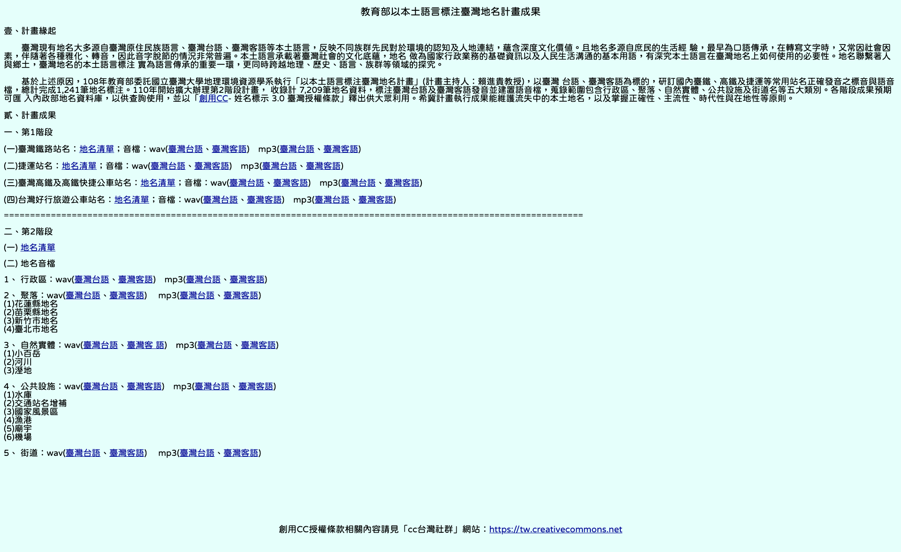

# KipTehomaDataMirror

Data mirror for ChhoeTaigi KipTehoma. This site provides direct access to the extracted KipTehoma (Taiwanese Place Names) audio and list data. The files are hosted on GitHub Pages for easy access.

## Chu-liāu Pán-koân

版權聲明
- [創用CC姓名標示 3.0 臺灣 授權條款](https://creativecommons.org/licenses/by/3.0/tw/)

## Latest Version

You can check [**manifest.json**](./public/manifest.json) for the latest version information programmatically.

## Accessing Files

The files are organized by version. Once updated, the latest files will be in `public/{version}/`.

### 1. List Data (`list/`)

* **Base URL:** `https://chhoetaigi.github.io/KipTehomaDataMirror/public/{version}/list/`
* **Structure:** `{filename}`

### 2. Audio Data MP3 (`audio_mp3/`)

* **Base URL:** `https://chhoetaigi.github.io/KipTehomaDataMirror/public/{version}/audio_mp3/`
* **Structure:** `{filename}`

### 3. Audio Data WAV (`audio_wav/`)

* **Base URL:** `https://chhoetaigi.github.io/KipTehomaDataMirror/public/{version}/audio_wav/`
* **Structure:** `{filename}`

## Chu-liāu bāng-chí

地名資料下載
1. [地名清單（placename_list.zip）](https://language.moe.gov.tw/001/Upload/Files/site_content/M0001/mhigeonames/placename_list.zip)
2. [臺鐵清單（railways_list.zip）](https://language.moe.gov.tw/001/Upload/Files/site_content/M0001/mhigeonames/railways_list.zip)
3. [高捷清單（tkmrt_list.zip）](https://language.moe.gov.tw/001/Upload/Files/site_content/M0001/mhigeonames/tkmrt_list.zip)
4. [高鐵清單（thsrc_list.zip）](https://language.moe.gov.tw/001/Upload/Files/site_content/M0001/mhigeonames/thsrc_list.zip)
5. [台灣好行清單（twtrip_list.zip）](https://language.moe.gov.tw/001/Upload/Files/site_content/M0001/mhigeonames/twtrip_list.zip)

音檔下載 (臺灣台語)
* **行政區:** [wav](https://language.moe.gov.tw/001/Upload/Files/site_content/M0001/mhigeonames/administrative_m_wav.zip), [mp3](https://language.moe.gov.tw/001/Upload/Files/site_content/M0001/mhigeonames/administrative_m_mp3.zip)
* **聚落:** [wav](https://language.moe.gov.tw/001/Upload/Files/site_content/M0001/mhigeonames/settlement_m_wav.zip), [mp3](https://language.moe.gov.tw/001/Upload/Files/site_content/M0001/mhigeonames/settlement_m_mp3.zip)
* **自然實體:** [wav](https://language.moe.gov.tw/001/Upload/Files/site_content/M0001/mhigeonames/naturalentity_m_wav.zip), [mp3](https://language.moe.gov.tw/001/Upload/Files/site_content/M0001/mhigeonames/naturalentity_m_mp3.zip)
* **公共設施:** [wav](https://language.moe.gov.tw/001/Upload/Files/site_content/M0001/mhigeonames/publicutilities_m_wav.zip), [mp3](https://language.moe.gov.tw/001/Upload/Files/site_content/M0001/mhigeonames/publicutilities_m_mp3.zip)
* **街道:** [wav](https://language.moe.gov.tw/001/Upload/Files/site_content/M0001/mhigeonames/street_m_wav.zip), [mp3](https://language.moe.gov.tw/001/Upload/Files/site_content/M0001/mhigeonames/street_m_mp3.zip)
* **臺鐵:** [wav](https://language.moe.gov.tw/001/Upload/Files/site_content/M0001/mhigeonames/railways_m_wav.zip), [mp3](https://language.moe.gov.tw/001/Upload/Files/site_content/M0001/mhigeonames/railways_m_mp3.zip)
* **高捷:** [wav](https://language.moe.gov.tw/001/Upload/Files/site_content/M0001/mhigeonames/tkmrt_m_wav.zip), [mp3](https://language.moe.gov.tw/001/Upload/Files/site_content/M0001/mhigeonames/tkmrt_m_mp3.zip)
* **高鐵:** [wav](https://language.moe.gov.tw/001/Upload/Files/site_content/M0001/mhigeonames/thsrc_m_wav.zip), [mp3](https://language.moe.gov.tw/001/Upload/Files/site_content/M0001/mhigeonames/thsrc_m_mp3.zip)
* **台灣好行:** [wav](https://language.moe.gov.tw/001/Upload/Files/site_content/M0001/mhigeonames/twtrip_m_wav.zip), [mp3](https://language.moe.gov.tw/001/Upload/Files/site_content/M0001/mhigeonames/twtrip_m_mp3.zip)

## Source

Original data source: 教育部以本土語言標注臺灣地名計畫 <https://language.moe.gov.tw/001/Upload/Files/site_content/M0001/mhigeonames/twplacename.html>
